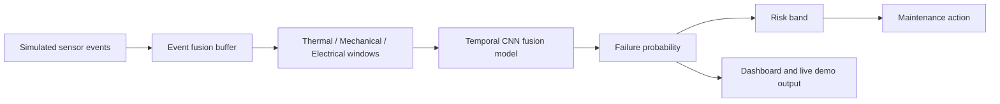

# Predictive Maintenance for Smart Factories

This repository now has two layers:

- `v1`: a clean, leakage-free tabular predictive maintenance baseline.
- `v2`: a neural smart-factory pipeline with simulated multi-sensor streams, temporal sensor fusion, live event ingestion, and an HTML dashboard.

That gives you the best project story:

1. You built a trustworthy baseline first.
2. You then extended it into a more ambitious neural smart-factory system.

## Core Idea

Title:
`Neural Predictive Maintenance System for Smart Factories using Multi-Sensor Data Fusion`

Objective:
Design a real-time predictive maintenance pipeline that ingests heterogeneous sensor streams and predicts equipment failure before breakdown, optimizing maintenance scheduling and reducing downtime.

## What Exists Now

### v1 baseline

The original rebuilt pipeline is still here and still useful.

What it does in easy words:
- It learns from tabular machine data without data leakage.
- It predicts failure risk and also runs a separate anomaly detector.
- It saves reproducible artifacts, metrics, and plots.

Main commands:

```bash
python -m src.train
python -m src.inference --demo
```

### v2 smart-factory neural system

This is the new layer added for your project vision.

What it does in easy words:
- It simulates a smart factory with multiple machines and timestamped sensor streams.
- It converts those readings into separate thermal, mechanical, and electrical sensor branches.
- It trains a neural temporal fusion model to predict whether a breakdown is coming soon.
- It replays sensor events one by one like a live system.
- It generates a dashboard-style HTML report with machine risk timelines and maintenance priority.
- It now also exposes a FastAPI service layer for health checks, predictions, stream resets, and simulation runs.

Example benchmark from the current saved v2 run:

- ROC-AUC: `0.9928`
- PR-AUC: `0.8890`
- Precision: `0.6667`
- Recall: `1.0000`
- Accuracy: `0.9612`

Important honesty note:
These v2 numbers come from the smart-factory simulator, not from a real industrial streaming dataset. They show that the pipeline works well on the designed scenario, but they should be presented as simulation results.

## v2 Architecture



## New v2 Files

- `src/v2_streaming.py`: creates multi-machine timestamped sensor streams and long-format sensor events.
- `src/v2_neural.py`: builds sequence datasets, branch scalers, and the neural fusion model.
- `src/v2_train.py`: trains the neural model and saves v2 artifacts.
- `src/v2_inference.py`: replays event streams and produces live predictions.
- `src/v2_dashboard.py`: creates an HTML dashboard report from the live predictions.
- `src/v2_api.py`: serves the v2 model through FastAPI.

## Why These Changes Matter

### 1. Real-time feeling

Easy meaning:
The system no longer feels like just a CSV classifier. It now behaves more like a factory monitoring pipeline.

### 2. Multi-sensor fusion

Easy meaning:
The model does not look at one sensor alone. It learns from groups of sensors together:
- thermal sensors
- mechanical sensors
- electrical sensors

### 3. Neural model

Easy meaning:
The project now has a real neural sequence model instead of only a classical ML model.

Important honesty note:
The original dataset does not contain true live factory time-series streams, so v2 uses a simulator grounded in the real dataset ranges to create a realistic smart-factory demo environment.

### 4. Better project storytelling

Easy meaning:
This now looks like a complete ML systems project:
- data
- simulation
- training
- live inference
- visualization
- tests

## How To Run

Install dependencies:

```bash
pip install -r requirements.txt
```

Run the baseline pipeline:

```bash
python -m src.train
python -m src.inference --demo
```

Train the smart-factory neural v2 model:

```bash
python -m src.v2_train
```

Run the live smart-factory demo:

```bash
python -m src.v2_inference --live-demo
```

Run the FastAPI service:

```bash
python -m src.v2_api
```

Then open:

```text
http://127.0.0.1:8000/docs
```

Generate the dashboard again from saved CSV files:

```bash
python -m src.v2_dashboard
```

Run tests:

```bash
python -m unittest discover -s tests -v
```

## What v2 Saves

After running `python -m src.v2_train`, the project saves artifacts in `outputs/v2/`, including:

- `temporal_fusion_model.keras`
- `branch_scalers.joblib`
- `neural_metadata.json`
- `neural_metrics.json`
- `simulated_stream.csv`
- `sensor_events.csv`
- `test_predictions.csv`
- `training_history.png`
- `precision_recall_curve.png`
- `roc_curve.png`

After running `python -m src.v2_inference --live-demo`, it also saves:

- `live_predictions.csv`
- `smart_factory_dashboard.html`

## FastAPI Endpoints

- `GET /health`: shows whether the v2 artifacts are present and whether the service is loaded.
- `GET /metadata`: returns the model metadata and required sensor schema.
- `POST /predict/fused`: sends one full fused machine reading.
- `POST /predict/events`: sends one or more sensor events and lets the API buffer them until a full reading is ready.
- `POST /stream/reset`: clears the in-memory stream buffers.
- `POST /simulate/run`: runs a full live simulation and returns top alerts plus dashboard paths.
- `GET /examples/fused-reading`: returns a valid example payload.

## Project Structure

```text
predictive_maintenance/
├── data/
├── outputs/
├── src/
│   ├── train.py
│   ├── inference.py
│   ├── v2_streaming.py
│   ├── v2_neural.py
│   ├── v2_train.py
│   ├── v2_inference.py
│   └── v2_dashboard.py
├── tests/
├── README.md
├── pyproject.toml
└── requirements.txt
```

## Portfolio Positioning

If you present this project well, the strongest message is:

1. You built a reliable predictive maintenance baseline with correct ML evaluation.
2. You extended it into a neural smart-factory monitoring system.
3. You added streaming logic, temporal sensor fusion, and dashboard output.
4. You showed both engineering discipline and product thinking.
