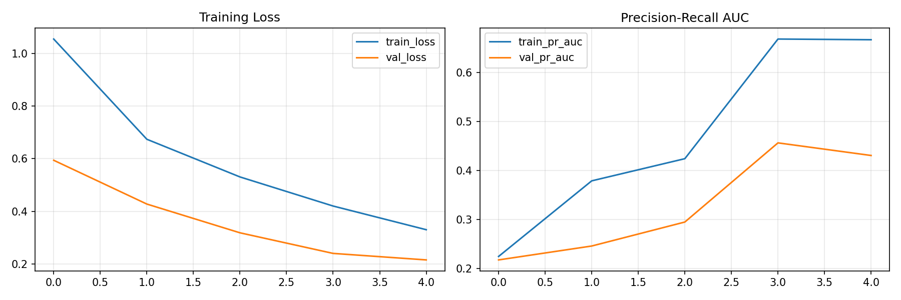
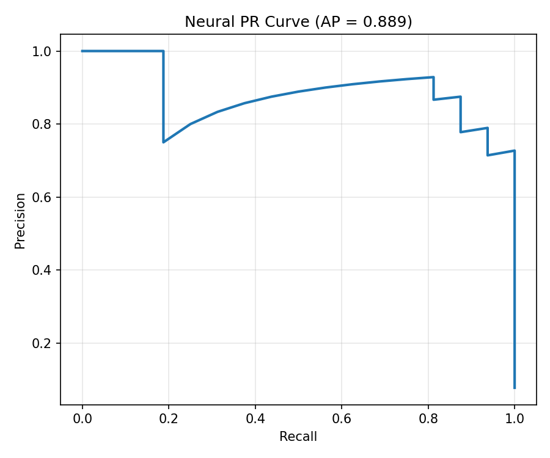
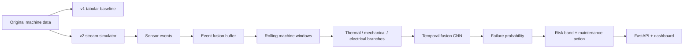

# Neural Predictive Maintenance System for Smart Factories

A predictive maintenance system that takes machine sensor data, turns it into failure-risk signals, and serves predictions through scripts, live stream simulation, dashboard output, and a FastAPI backend.

Easy meaning: this is not only a model training notebook. I tried to build the surrounding system too.

## Core Idea

**Title:** `Neural Predictive Maintenance System for Smart Factories using Multi-Sensor Data Fusion`

**Objective:** Design a real-time predictive maintenance pipeline that ingests heterogeneous sensor streams and predicts equipment failure before breakdown, optimizing maintenance scheduling and reducing downtime.

## Demo / Visuals

After running the v2 pipeline, the project generates visual and service outputs here:

- Dashboard report: [`outputs/v2/smart_factory_dashboard.html`](outputs/v2/smart_factory_dashboard.html)
- Live predictions: [`outputs/v2/live_predictions.csv`](outputs/v2/live_predictions.csv)
- API docs after starting the server: `http://127.0.0.1:8000/docs`
- Training curve: [`outputs/v2/training_history.png`](outputs/v2/training_history.png)
- Precision-recall curve: [`outputs/v2/precision_recall_curve.png`](outputs/v2/precision_recall_curve.png)
- ROC curve: [`outputs/v2/roc_curve.png`](outputs/v2/roc_curve.png)





## What This Project Does

The project has two layers.

**v1: leakage-free tabular baseline**

This uses the original predictive maintenance dataset as a normal tabular ML problem. It trains a strong baseline model, evaluates it on a proper holdout split, saves metrics, and also includes anomaly detection.

**v2: neural smart-factory simulation**

This adds the system I actually wanted to build for the project idea: multi-machine sensor streams, sensor event fusion, rolling windows, a neural temporal fusion model, live inference, an HTML dashboard, and a FastAPI service.

The original dataset is not a real streaming factory dataset, so the v2 stream is simulated using realistic ranges from the original data. I am keeping that clear because fake claims make a project weaker, not stronger.

## System Flow

1. Start with machine sensor data.
2. Train a clean v1 baseline on the original tabular dataset.
3. Simulate timestamped readings for multiple factory machines.
4. Convert full readings into individual sensor events.
5. Buffer events until one complete machine reading is available.
6. Keep a rolling time window for each machine.
7. Split features into thermal, mechanical, and electrical sensor groups.
8. Send those groups into a neural temporal fusion model.
9. Produce failure probability, risk band, and maintenance recommendation.
10. Serve the result through FastAPI and save dashboard/report outputs.

## Architecture



## Why This Project Is Interesting

Most predictive maintenance projects stop at "train model, print accuracy." I wanted this one to feel closer to how a real monitoring system would be shaped.

The interesting part is the connection between the ML and the system design:

- The model has to work with time windows, not just one row.
- Sensors arrive as events, so they need to be fused before prediction.
- Each machine keeps its own memory buffer.
- The output is not only `0` or `1`; it becomes a risk score and maintenance action.
- The classical baseline is still kept, so the neural part has something honest to compare against.

## Current Results

### v1 baseline results

These results come from the original tabular dataset with a proper train/validation/test split.

| Metric | Value |
|---|---:|
| ROC-AUC | `0.9848` |
| PR-AUC | `0.8619` |
| Precision | `0.9322` |
| Recall | `0.8088` |
| Accuracy | `0.9915` |

### v2 neural simulation results

These results come from the simulated smart-factory stream, not real plant telemetry.

| Metric | Value |
|---|---:|
| ROC-AUC | `0.9928` |
| PR-AUC | `0.8890` |
| Precision | `0.6667` |
| Recall | `1.0000` |
| Accuracy | `0.9612` |

For maintenance use cases, recall matters a lot because missing a failure can be expensive. I still track precision because too many false alarms would also be annoying in a real factory.

## Engineering Decisions

**I kept v1 as a baseline.**

The original dataset is tabular, so forcing an LSTM directly on it would not be very honest. The v1 baseline is there to show the normal ML solution first.

**I added v2 as a simulated streaming system.**

Since the project idea is about smart factories and multi-sensor streams, v2 creates that environment with multiple machines, timestamps, event streams, and rolling windows.

**I split sensors by type before the neural model.**

Thermal, mechanical, and electrical signals are handled as separate branches before fusion. This makes the model structure match the real idea better than throwing every column into one flat input.

**I used event buffering for live inference.**

In a real system, sensors may not arrive as one perfect row. The API can receive sensor events one by one and fuse them when a complete reading is ready.

**I kept the deployment simple.**

FastAPI is enough for this stage. The API exposes health checks, metadata, predictions, stream reset, and simulation runs without adding unnecessary infrastructure.

## Tech Stack

- Python
- pandas, NumPy, scikit-learn
- TensorFlow / Keras
- FastAPI + Uvicorn
- Plotly / Matplotlib
- unittest

## How To Run

Create and activate a virtual environment:

```bash
python -m venv .venv
```

On Windows PowerShell:

```powershell
.\.venv\Scripts\Activate.ps1
```

Install dependencies:

```bash
pip install -r requirements.txt
```

Train the v1 baseline:

```bash
python -m src.train
```

Run v1 demo inference:

```bash
python -m src.inference --demo
```

Train the v2 neural smart-factory model:

```bash
python -m src.v2_train
```

Run the live v2 stream demo:

```bash
python -m src.v2_inference --live-demo
```

Start the API:

```bash
python -m src.v2_api
```

Then open:

```text
http://127.0.0.1:8000/docs
```

Run tests:

```bash
python -m unittest discover -s tests -v
```

## FastAPI Endpoints

| Endpoint | Purpose |
|---|---|
| `GET /health` | Check if the service and artifacts are available |
| `GET /metadata` | View model settings and required sensor schema |
| `POST /predict/fused` | Send one complete machine reading |
| `POST /predict/events` | Send sensor events and let the API fuse them |
| `POST /stream/reset` | Clear in-memory machine buffers |
| `POST /simulate/run` | Run a full simulated live stream |
| `GET /examples/fused-reading` | Get a valid sample payload |

## Project Structure

```text
predictive_maintenance/
|-- data/
|   `-- predictive_maintenance.csv
|-- notebooks/
|   |-- 01_eda.ipynb
|   |-- 02_preprocessing.ipynb
|   `-- 03_modelling.ipynb
|-- outputs/
|   |-- metrics.json
|   |-- model_bundle.joblib
|   `-- v2/
|       |-- temporal_fusion_model.keras
|       |-- neural_metrics.json
|       |-- live_predictions.csv
|       `-- smart_factory_dashboard.html
|-- src/
|   |-- train.py
|   |-- inference.py
|   |-- features.py
|   |-- model.py
|   |-- anomaly.py
|   |-- v2_streaming.py
|   |-- v2_neural.py
|   |-- v2_train.py
|   |-- v2_inference.py
|   |-- v2_dashboard.py
|   `-- v2_api.py
|-- tests/
|-- requirements.txt
|-- pyproject.toml
`-- README.md
```

## What Gets Saved

The v1 pipeline saves:

- trained model bundle
- metrics JSON
- feature importance
- scored predictions
- ROC and precision-recall plots

The v2 pipeline saves:

- neural model
- branch scalers
- model metadata
- simulated stream data
- sensor event data
- live prediction output
- dashboard HTML
- training and evaluation plots

## Known Limitations

- The v2 smart-factory stream is simulated. It is useful for showing system design, but it is not the same as training on real factory telemetry.
- The FastAPI service keeps stream buffers in memory. For production, I would move state to Redis or another external store.
- There is no real message broker yet. MQTT or Kafka would make the streaming part more realistic.
- The dashboard is generated as HTML. A proper web dashboard would be better for interactive monitoring.
- The model should be recalibrated before any real maintenance use.

## Real-World Extension Plan

The next practical upgrades would be:

- Add MQTT or Kafka ingestion for live sensor messages.
- Dockerize the API and model artifacts.
- Add a small frontend dashboard for machine risk monitoring.
- Add drift monitoring for sensor distributions.
- Store predictions in a database for historical analysis.
- Test the pipeline on a real industrial time-series dataset.

## My Main Takeaway

The biggest lesson from this project was that predictive maintenance is not just a classification problem.

The model matters, but the system around it matters just as much: how sensor data arrives, how readings are fused, how risk is served, and how the output becomes a maintenance decision.
